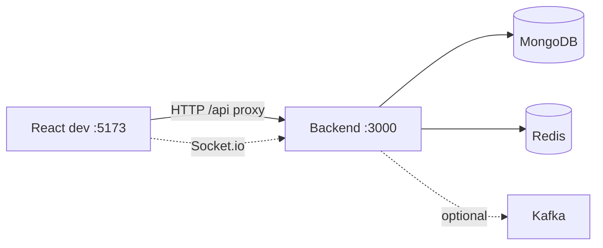

# MERN real-time chat (React + Express + Redis + MongoDB + Kafka)

Single **Express** backend with a `src/` layout: `config/`, `controllers/`, `middleware/`, `models/`, `routes/`, `services/`, `sockets/`, `events/`, `utils/`, plus `app.js` (HTTP app) and `server.js` (HTTP + Socket.io + optional Kafka).

- **Auth (JWT)**: register, login, `GET /api/auth/me`, forgot / reset password (email when SMTP is configured)
- **Chat**: direct messages, groups, file uploads, in-app + browser notifications, presence, typing
- **Real time**: Socket.io on the same port as the API, **Redis** adapter (and presence / dedup)
- **Messaging pipeline**: optional **Kafka** topic `message_sent`; with **`SKIP_KAFKA=true`** the same pipeline runs inline (no broker)
- **Docs**: Swagger UI at **`/docs`**, OpenAPI at **`/openapi.json`**
- **Frontend**: Vite + React + Tailwind; dev server proxies **`/api`** to the backend

## Architecture



Use **`VITE_SOCKET_URL=http://localhost:3000`** so the client connects to the same host/port as the API.

## Prerequisites

- **Node.js** 20+
- **MongoDB** and **Redis** running locally (or URLs in `.env`)
- **Kafka**: optional for development — use Docker (below) or set **`SKIP_KAFKA=true`** in `backend/.env`
- **SMTP**: optional (e.g. [MailHog](https://github.com/mailhog/MailHog) on `localhost:1025` for password reset emails)

## Quick start

1. **Environment**

   - Copy **`backend/.env.example`** → **`backend/.env`** and edit secrets and URLs.
   - Copy **`frontend/.env.example`** → **`frontend/.env`**.
   - Leave **`VITE_API_BASE`** empty so Vite proxies `/api` to the backend (avoids CORS issues). Set **`VITE_SOCKET_URL`** to your backend URL (default `http://localhost:3000`).

2. **Install**

```bash
npm run install:all
```

3. **Run backend + frontend**

```bash
npm run dev
```

4. Open **http://localhost:5173** — register, then open direct or group chats.

### Ports

| Service | URL |
| --- | --- |
| Frontend (Vite) | http://localhost:5173 |
| Backend (REST + Socket.io + Swagger + static uploads) | http://localhost:3000 |

### Health

`GET http://localhost:3000/health` returns `{ "status": "ok" }`.

## Kafka (optional)

Messages are produced to topic **`message_sent`** (see **`backend/src/events/kafkaProducer.js`**) and consumed in **`backend/src/events/kafkaConsumer.js`**, which runs the same **`persistIncomingMessage`** logic as the inline path in **`backend/src/services/messagePipeline.js`**.

**Without Kafka**, set in **`backend/.env`**:

```env
SKIP_KAFKA=true
```

**With Kafka via Docker** (from the repo root):

```bash
docker compose -f docker-compose.kafka.yml up -d
```

Then set **`SKIP_KAFKA=false`**, **`KAFKA_BROKERS=localhost:9092`** (adjust if you remap the host port in `docker-compose.kafka.yml`). Stop with:

```bash
docker compose -f docker-compose.kafka.yml down
```

If port **9092** is busy, change the published port in the compose file and set **`KAFKA_BROKERS`** accordingly.

For a **native** Kafka install, use the [Apache Kafka documentation](https://kafka.apache.org/documentation/) and point **`KAFKA_BROKERS`** at your broker.

## Backend layout (`backend/src/`)

| Path | Role |
| --- | --- |
| `app.js` | Express app: middleware, `/api/auth`, `/api/chat`, `/docs`, `/files` |
| `server.js` | HTTP server, Redis clients, Socket.io + Redis adapter, Kafka producer/consumer when enabled |
| `config/` | `env`, DB, multer, Swagger |
| `controllers/` | Auth, users, messages, groups, notifications |
| `middleware/` | HTTP JWT (`requireAuth` / `requireUserHttp`) |
| `models/` | User, Message, Group, Notification |
| `routes/` | `authRoutes`, `chatRoutes` |
| `services/` | `messagePipeline`, `mailService` |
| `sockets/` | Socket.io auth, rooms, `send_message`, `typing`, `sync_groups` |
| `events/` | Kafka producer / consumer |

## Environment (`backend/.env`)

| Variable | Purpose |
| --- | --- |
| `MONGO_URI` | MongoDB connection string |
| `JWT_SECRET`, `JWT_EXPIRES_IN` | Signing JWTs |
| `REDIS_URL` | Redis for Socket.io adapter + app usage |
| `SKIP_KAFKA` | `true` = process messages without Kafka |
| `KAFKA_BROKERS`, `KAFKA_TOPIC_MESSAGE_SENT` | Broker list and topic name when Kafka is enabled |
| `PUBLIC_BASE_URL` | Base URL for links (e.g. reset emails) |
| `UPLOAD_DIR`, `MAX_FILE_SIZE_BYTES` | File storage |
| `SMTP_*`, `EMAIL_FROM`, `FRONTEND_URL` | Password reset mail |

Optional: **`CORS_ORIGIN`** (comma-separated origins) for the Express `cors` middleware.

## API (short)

- **Auth**: `POST /api/auth/register`, `POST /api/auth/login`, `GET /api/auth/me`, forgot/reset password routes — details in **`/docs`**
- **Chat** (header **`Authorization: Bearer <token>`**): users, messages, groups, uploads, notifications — **`/docs`**

## Security notes

Helmet, bcrypt for passwords, JWT for chat routes, upload size/MIME limits, and **express-rate-limit** on the whole app (stricter limits on forgot-password routes in `authRoutes`).
